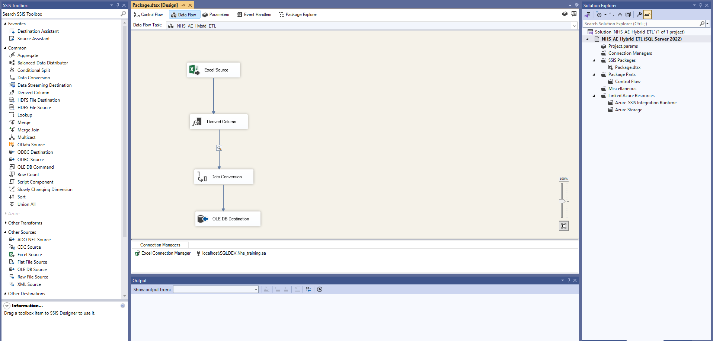
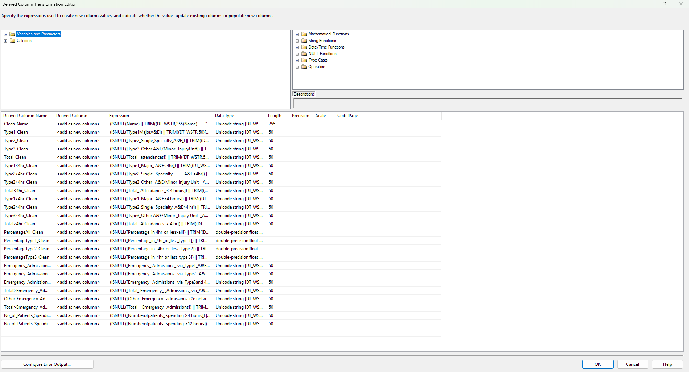
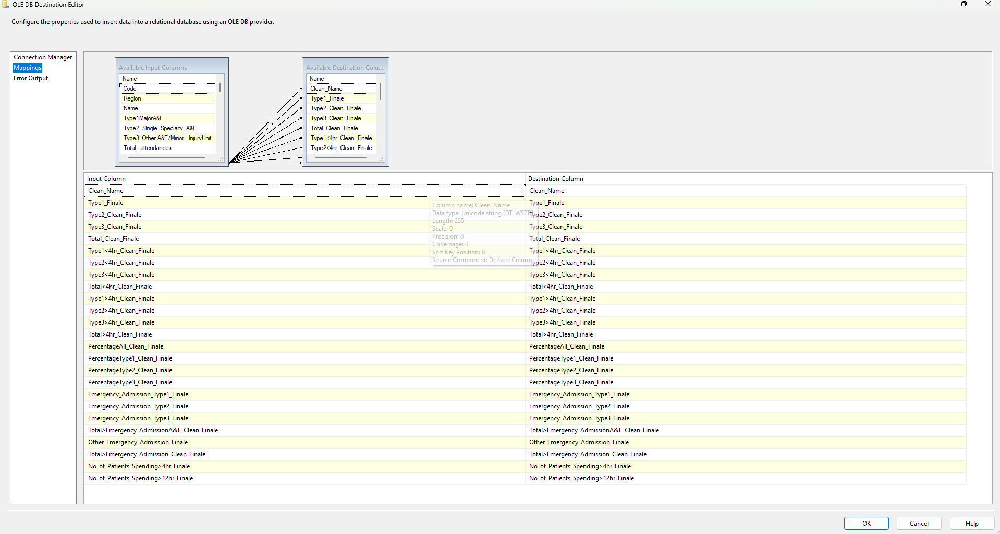
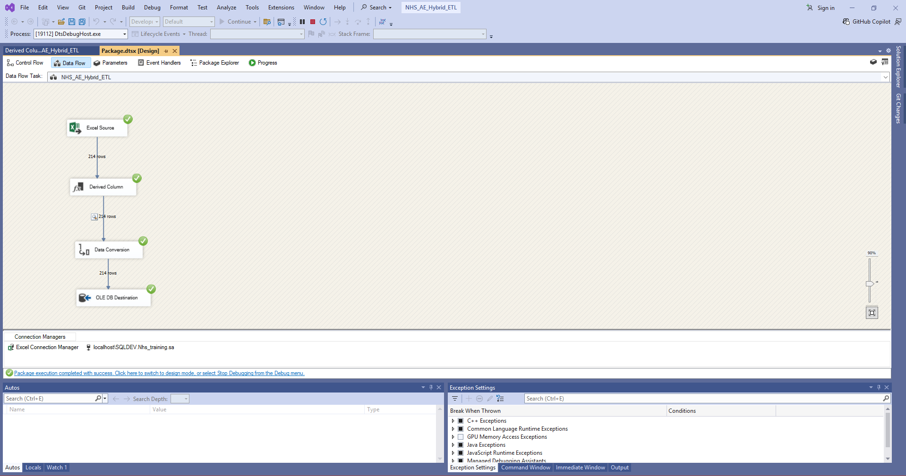

# NHS A&E Data – End-to-End ETL Pipeline
🔍 Overview

This project demonstrates a real-world ETL pipeline built using SSIS, SQL Server, and Power BI-ready outputs. The pipeline ingests messy NHS A&E attendance data from Excel, performs data cleansing and transformations, and loads validated data into a relational database.

🎯 Objective

Clean and standardise NHS A&E data

Handle real-world data quality issues

Load analytics-ready data into SQL Server

Prepare data for reporting and BI consumption

🧱 Architecture

Hybrid ETL

SSIS for extraction & transformation

SQL Server for schema enforcement & validation

Power BI as the analytics layer

🔹 Data Challenges Addressed

Numbers stored as text

Thousand separators and percentage symbols

NULL and blank values

Mixed data types🔹 ETL Flow

Excel Source – Ingest NHS A&E data

Derived Column – Clean text, remove symbols, handle NULLs

Data Conversion – Convert cleaned strings to numeric types

OLE DB Destination – Load into SQL Server tables

🧪 Validation

Row count checks

Data type verification

Sample record inspection using SQL

🛠 Tools Used

SSIS

SQL Server / SSMS

Excel

Power BI

✅ Outcome

Clean, validated dataset

Analytics-ready tables

Repeatable ETL pipeline design

## 🔹 SSIS Data Flow

## 🔹 Data Cleansing – Derived Column

## 🔹 Load to SQL Server

## 🔹 Successful Package Execution

